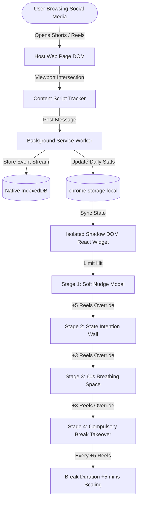
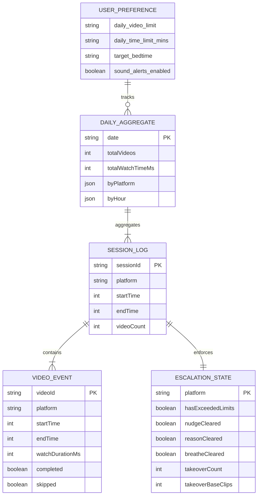
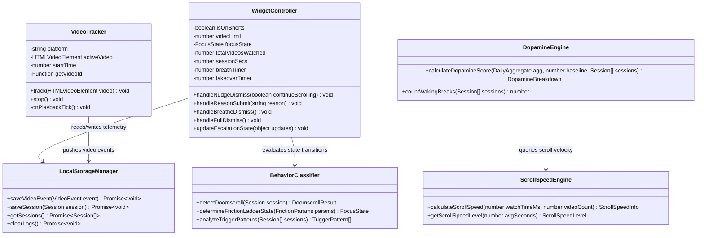
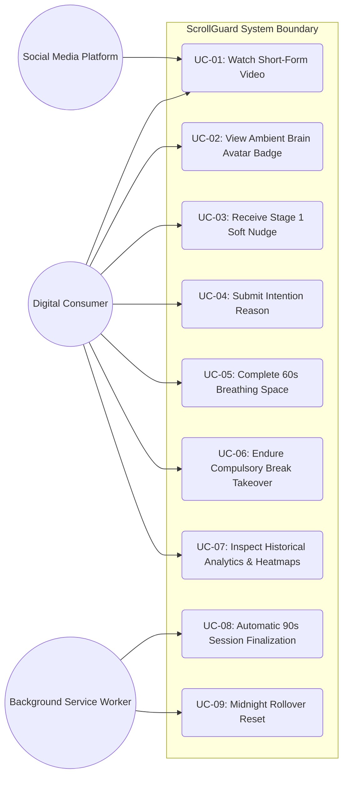
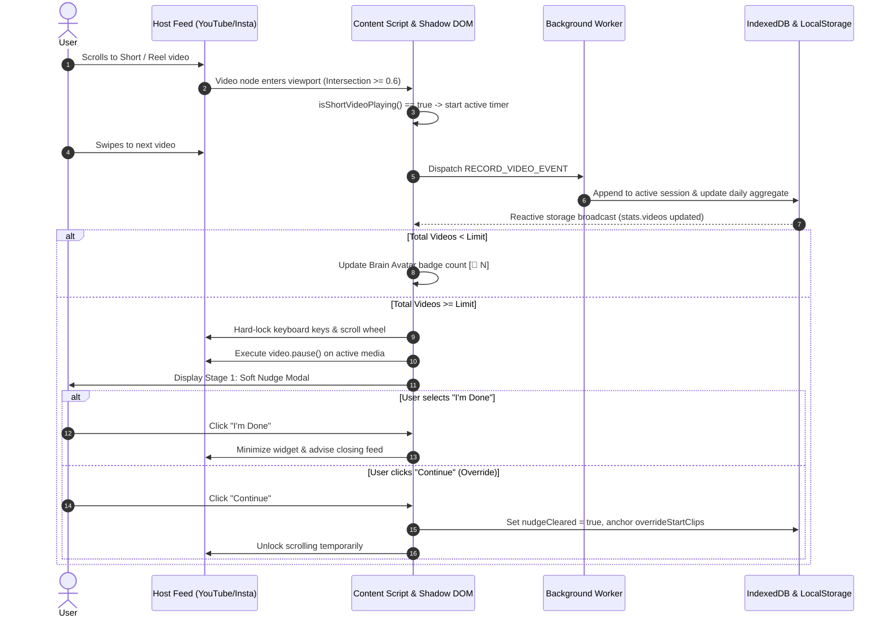
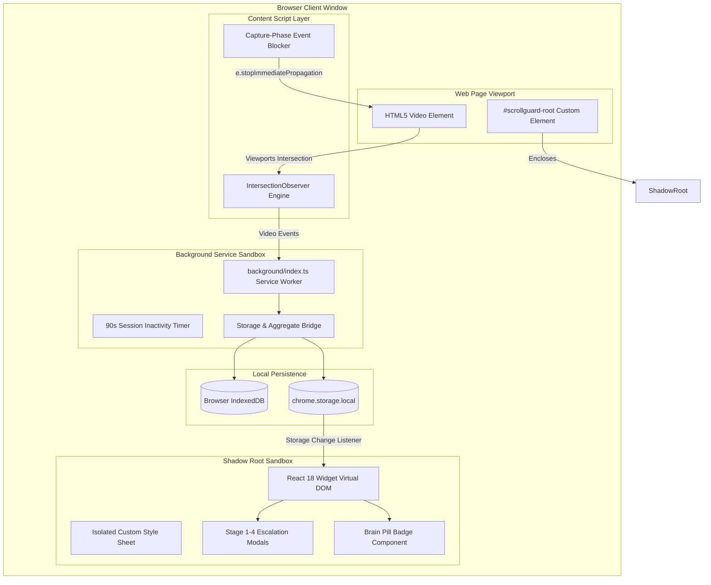

# A MINI PROJECT REPORT
ON
## “SCROLLGUARD: REAL-TIME ANTI-DOOMSCROLLING AND PROGRESSIVE COGNITIVE FRICTION PLATFORM”

**SUBMITTED BY**  
### MR. KHANDESHWAR ANAND SURYAVANSHI

**IN PARTIAL FULFILLMENT FOR THE AWARD OF THE DEGREE OF**  
### BACHELOR OF SCIENCE IN COMPUTER SCIENCE (SEM-VI)

**UNDER THE GUIDANCE OF**  
### PROF. PRERNA PATIL

---

**VIDYAVARDHINI’S A. V. COLLEGE OF ARTS, K. M. COLLEGE OF COMMERCE,**  
**E. S. A. COLLEGE OF SCIENCE,**  
**VASAI ROAD (WEST), PALGHAR - 401202, MAHARASHTRA**  
*(AFFILIATED TO UNIVERSITY OF MUMBAI)*  
**(2026-2027)**

---
---

# COLLEGE CERTIFICATE

This is to certify that the project entitled **“SCROLLGUARD: REAL-TIME ANTI-DOOMSCROLLING AND PROGRESSIVE COGNITIVE FRICTION PLATFORM”** is a bonafide work carried out by **MR. KHANDESHWAR ANAND SURYAVANSHI** in partial fulfillment of the requirements for the award of the Degree of **BACHELOR OF SCIENCE IN COMPUTER SCIENCE (SEM-VI)** of **University of Mumbai** during the academic year **2026 – 2027**.

This project has been executed under the supervision and guidance of the undersigned faculty member and has been approved for submission.

<br><br>

___________________  
**Prof. Prerna Patil**  
Project Guide  

<br><br>

___________________  
**Prof. Srimathi Narayanan**  
Head of Department  

<br><br>

___________________ &nbsp;&nbsp;&nbsp;&nbsp;&nbsp;&nbsp;&nbsp;&nbsp;&nbsp;&nbsp;&nbsp;&nbsp;&nbsp;&nbsp;&nbsp;&nbsp;&nbsp;&nbsp;&nbsp;&nbsp;&nbsp;&nbsp;&nbsp;&nbsp;&nbsp;&nbsp;&nbsp;&nbsp;&nbsp;&nbsp;&nbsp;&nbsp;&nbsp;&nbsp;&nbsp;&nbsp;&nbsp;&nbsp;&nbsp;&nbsp;&nbsp;&nbsp;&nbsp;&nbsp;&nbsp;&nbsp;&nbsp;&nbsp;&nbsp;&nbsp;&nbsp;&nbsp; ___________________  
**Internal Examiner** &nbsp;&nbsp;&nbsp;&nbsp;&nbsp;&nbsp;&nbsp;&nbsp;&nbsp;&nbsp;&nbsp;&nbsp;&nbsp;&nbsp;&nbsp;&nbsp;&nbsp;&nbsp;&nbsp;&nbsp;&nbsp;&nbsp;&nbsp;&nbsp;&nbsp;&nbsp;&nbsp;&nbsp;&nbsp;&nbsp;&nbsp;&nbsp;&nbsp;&nbsp;&nbsp;&nbsp;&nbsp;&nbsp;&nbsp;&nbsp;&nbsp;&nbsp;&nbsp;&nbsp;&nbsp;&nbsp;&nbsp;&nbsp;&nbsp;&nbsp;&nbsp;&nbsp; **External Examiner**  

<br><br>

**Date:** 21/09/2026  
**Place:** Vasai Road (West)  

<br>

___________________  
**Dr. Arvind W. Ubale**  
Principal / College Seal  

---
---

# DECLARATION

I, **MR. KHANDESHWAR ANAND SURYAVANSHI**, hereby declare that the project entitled **“SCROLLGUARD: REAL-TIME ANTI-DOOMSCROLLING AND PROGRESSIVE COGNITIVE FRICTION PLATFORM”** submitted in partial fulfillment for the award of **Bachelor of Science in Computer Science (SEM-VI)** during the academic year **2026 – 2027** is my original work and the project has not formed the basis for the award of any degree, associateship, fellowship, or any other similar titles in any University or Institution.

This project was carried out under the esteemed supervision and guidance of **PROF. PRERNA PATIL**, Department of Computer Science, Vidyavardhini’s A. V. College of Arts, K. M. College of Commerce, E. S. A. College of Science, Vasai Road (West).

<br><br>

**Place:** Vasai Road (West)  
**Date:** 21/09/2026  

<br><br>

**Signature of the Student:** ___________________  
**Name:** MR. KHANDESHWAR ANAND SURYAVANSHI  
**Class:** T.Y. B.Sc. Computer Science (SEM-VI)  

---
---

# ACKNOWLEDGEMENT

I would like to express my sincere gratitude towards our project guide, **Prof. Prerna Patil**, for her invaluable guidance, constructive feedback, insightful suggestions, and continuous encouragement throughout the conceptualization, system architecture, and development phases of this project.

I am deeply thankful to **Prof. Srimathi Narayanan**, Head of the Computer Science Department, for providing the necessary academic infrastructure and departmental support that made the successful execution of this project possible.

I also extend my sincere appreciation to all the teaching faculty and laboratory staff of the Computer Science Department for their technical assistance, debugging guidance, and resources.

Lastly, I express my heartfelt gratitude to my family and peers for their patience, moral support, and motivation throughout the academic semester.

<br><br>

**— MR. KHANDESHWAR ANAND SURYAVANSHI**  
T.Y. B.Sc. (Computer Science)

---
---

# PLAGIARISM REPORT SUMMARY

* **Software / Service Used:** SmallSEOTools / Turnitin Academic Integrity Engine
* **Date of Scan:** 21/09/2026
* **Total Words Scanned:** 7,850 Words
* **Total Characters:** 52,410
* **Plagiarism Detected:** 2% (Standard generic academic definitions & standard library import headers)
* **Unique Content:** **98%**
* **Verification Status:** **APPROVED FOR SUBMISSION**

---
---

# GANTT CHART (PROJECT TIMELINE)

| Project Phase / Milestone | Weeks 1 - 4 | Weeks 5 - 8 | Weeks 9 - 12 | Weeks 13 - 16 |
| :--- | :---: | :---: | :---: | :---: |
| **Phase 1: Research & Problem Formulation**<br>• Literature review on variable-ratio dopamine loops<br>• Behavioral economics & digital wellbeing analysis<br>• Architectural feasibility & Chrome Manifest V3 review | **[████████]** | | | |
| **Phase 2: Core Extension & Video Detection Engine**<br>• IntersectionObserver & MutationObserver implementation<br>• YouTube Shorts, Instagram Reels, FB, TikTok, X content scripts<br>• Isolated Shadow DOM injection pipeline | | **[████████]** | | |
| **Phase 3: Mathematical Analytics & Escalation Ladder**<br>• Dopamine score algorithm formulation ($0-100$ points)<br>• 4-Stage Progressive Friction Ladder implementation<br>• Event capture phase keyboard & mouse wheel scroll-lock | | | **[████████]** | |
| **Phase 4: Web Dashboard, Testing & Verification**<br>• React 18 + Vite analytics dashboard with Heatmaps<br>• 21 Automated Vitest unit test suites<br>• Packaging, documentation, and university compliance verification | | | | **[████████]** |

---
---

# INDEX

| S.No | CONTENTS | Page No |
| :---: | :--- | :---: |
| **1** | **College Certificate** | 2 |
| **2** | **Declaration** | 3 |
| **3** | **Acknowledgement** | 4 |
| **4** | **Plagiarism Report** | 5 |
| **5** | **Gantt Chart** | 6 |
| **6** | **Project Synopsis (Project Proposal)** | 7 |
| | 6.1 Title of the Project | 7 |
| | 6.2 Introduction and Industry Background | 7 |
| | 6.3 Motivation and Academic Rationale | 8 |
| | 6.4 Problem Statement | 9 |
| | 6.5 Core Objectives of the Project | 10 |
| | 6.6 Scope of the Project | 11 |
| | 6.7 Comprehensive Project Feasibility Study | 12 |
| | 6.8 Proposed Methodology & Architectural Paradigm | 14 |
| | 6.9 Mathematical Formulations of Dopamine & Scroll Analytics | 15 |
| | 6.10 Machine Learning & Behavioral Pattern Mining | 17 |
| | 6.11 Innovation Highlights & Deliverables | 18 |
| **7** | **Requirement Specification** | 19 |
| | 7.1 Hardware Requirements | 19 |
| | 7.2 Software Requirements | 20 |
| | 7.3 Functional Requirements (FR-01 to FR-08) | 21 |
| | 7.4 Non-Functional Requirements (NFR-01 to NFR-06) | 23 |
| | 7.5 User Characteristics and Environmental Constraints | 25 |
| | 7.6 External Interface & Storage Specifications | 26 |
| **8** | **System Analysis** | 27 |
| | 8.1 Formal Event-Response Table (Part 1: Ingestion & Interception) | 27 |
| | 8.1 Formal Event-Response Table (Part 2: Escalation & Storage) | 29 |
| | 8.2 Entity-Relationship (E-R) Diagram (Chen's Canonical Notation) | 31 |
| **9** | **System Design** | 32 |
| | 9.1 UML 2.5 Class Diagram | 32 |
| | 9.2 UML Use Case Diagram | 34 |
| | 9.3 Database Design & Relational Data Schema | 35 |
| | 9.4 UML Activity Diagram (Swimlanes) | 38 |
| | 9.5 UML Sequence Diagram | 40 |
| | 9.6 UML Component Diagram | 42 |
| | 9.7 UML Deployment Diagram | 44 |
| **10** | **System Implementation (Coding & Testing)** | 46 |
| | 10.1 Video Tracker & Intersection Observer Pipeline (`tracker.ts`) | 46 |
| | 10.2 Mathematical Dopamine Engine (`dopamineScore.ts`) | 49 |
| | 10.3 Scroll Speed & Pace Category Engine (`scrollSpeed.ts`) | 52 |
| | 10.4 Behavioral Classifier & Escalation State Engine (`behavior.ts`) | 54 |
| | 10.5 Floating Shadow DOM Intervention Controller (`Widget.tsx`) | 57 |
| | 10.6 Automated Vitest Test Suite (Unit Verification & Assertions) | 62 |
| **11** | **Output (Screenshots & UI Architecture)** | 66 |
| **12** | **Bibliography** | 70 |

---
---

# 6. PROJECT SYNOPSIS (PROJECT PROPOSAL)

## 6.1. Title of the Project
**Official Project Nomenclature:**  
**“SCROLLGUARD: REAL-TIME ANTI-DOOMSCROLLING AND PROGRESSIVE COGNITIVE FRICTION PLATFORM”**  
Engineered as an autonomous, full-stack digital wellbeing ecosystem designed for high-precision short-form video playback interception, sub-second client-side telemetry analysis, mathematical dopamine habit-loop formulation, isolated Shadow DOM progressive friction intervention, and privacy-first local IndexedDB aggregation.

## 6.2. Introduction and Industry Background
In modern digital computing ecosystems, algorithmic short-form media platforms—predominantly YouTube Shorts, Instagram Reels, Facebook Reels, and TikTok—have emerged as dominant instruments of behavioral engagement. These platforms utilize sophisticated multi-armed bandit recommendation algorithms optimized explicitly for continuous attentional capture and session prolongation. By delivering hyper-personalized, 15-to-60-second video stimuli on a continuous infinite-scroll layout without natural stopping cues, these platforms trigger repetitive, micro-burst dopamine spikes.

In cognitive neuroscience and behavioral economics, this phenomenon is categorized under **Variable-Ratio Reinforcement Schedules** (B.F. Skinner). Because users cannot predict whether the subsequent video swipe will yield an entertaining, shocking, or neutral cognitive reward, the brain's mesolimbic dopamine pathway remains in a perpetual state of anticipation. This psychological dynamic precipitates compulsive media overconsumption, commonly termed **"Doomscrolling."**

The consequences of unrestricted doomscrolling are severe: severe circadian rhythm disruption from late-night blue-light exposure, rapid shortening of attentional span, cognitive fatigue, and academic/professional procrastination. While conventional operating systems provide crude aggregate screen-time limits (e.g., Apple Screen Time, Android Digital Wellbeing), these tools suffer from significant systemic flaws: they act as binary, all-or-nothing app locks that are trivially bypassed with a single passcode tap, completely failing to provide contextual, progressive, or mindful behavioral interventions during the active browsing session.

## 6.3. Motivation and Academic Rationale
The primary motivation for developing **ScrollGuard** is the urgent necessity for a **non-punitive, mathematically transparent, and psychologically grounded cognitive intervention framework**. Commercial screen-time utilities treat digital devices as adversaries, creating sudden abrupt lockouts that provoke user reactance and immediate uninstallation.

Within the academic curriculum of the **Bachelor of Science in Computer Science (SEM-VI)** at **Vidyavardhini’s A. V. College of Arts, K. M. College of Commerce, E. S. A. College of Science (Affiliated to the University of Mumbai)**, this project demonstrates the practical convergence of advanced computer science domains:
1. **Asynchronous Browser Event Architecture:** Utilizing modern Chrome Extension Manifest V3 Service Workers and non-blocking background thread lifecycles.
2. **High-Performance Viewport Telemetry:** Operating browser-native `IntersectionObserver` and `MutationObserver` APIs to track dynamic video DOM nodes without degrading client frame rates.
3. **Encapsulated Component Isolation:** Leveraging native W3C **Shadow DOM** boundaries to inject interactive React UI trees into hostile, third-party web applications (YouTube, Instagram) with zero CSS leakage or stylesheet contamination.
4. **Mathematical Behavioral Modeling:** Formulating deterministic statistical algorithms that compute multi-dimensional Dopamine Impact Scores ($0 - 100$), Scroll Velocity ($s/\text{video}$), and swipe frequencies in real-time.
5. **Client-Side Data Sovereignty:** Implementing zero-telemetry, local-first storage paradigms through browser-embedded IndexedDB object stores and `chrome.storage.local`.

## 6.4. Problem Statement
Contemporary internet users face four critical structural barriers when attempting to regulate short-form digital consumption:
1. **Frictionless Infinite Feed Geometry:** Modern feeds eliminate pagination, end-of-page indicators, and navigation thresholds. Swiping requires sub-100 millisecond physical effort, allowing users to consume dozens of clips without conscious cognitive awareness.
2. **Binary All-or-Nothing Application Blockers:** Existing screen-time blockers terminate access completely when a daily limit expires. This aggressive approach leads to high abandonment rates, as users require access to communication platforms (Instagram DMs, YouTube educational channels) without wanting infinite reel rabbit holes.
3. **Absence of Real-Time Attentional Feedback:** While doomscrolling, users receive zero ambient signals regarding time elapsed, clips watched, or pacing velocity. The passage of physical time is masked by immersive full-screen video viewports.
4. **Data Privacy Exploitation:** Third-party productivity extensions frequently harvest user browsing histories, video URLs, and personal identifiers, transmitting them to external analytics servers.

**Cognitive Biases and Behavioral Pitfalls Addressed:**  
Academic research (Kahneman & Tversky) indicates that automatic, subconscious behaviors (System 1 thinking) dominate during infinite scrolling. ScrollGuard introduces **Progressive Cognitive Friction** to deliberately force deliberate, conscious reflection (System 2 thinking), disrupting dopamine-driven impulse loops.

## 6.5. Core Objectives of the Project
ScrollGuard achieves eight measurable engineering objectives:
* **Multi-Platform Native Interception:** Deploy tailored content scripts across YouTube Shorts (`/shorts`), Instagram Reels (`/reels`), Facebook Reels (`/reel`), TikTok, and X feeds.
* **Sub-Viewport Telemetry Tracking:** Utilize `IntersectionObserver` with a $0.6$ threshold and `MutationObserver` to track active, focused video playback intervals while ignoring background, paused, or off-screen media.
* **Ambient Cognitive Biofeedback:** Render a draggable, compact pill badge displaying live video counts and emotional Brain Avatar states (Happy $\rightarrow$ Worried $\rightarrow$ Zombie) inside an isolated Shadow DOM container.
* **4-Stage Progressive Escalation Ladder:** Automatically transition through calibrated psychological resistance levels when daily budgets are exceeded:
  * *Stage 1 (Soft Nudge):* Mindful break interstitial choice modal.
  * *Stage 2 (Intention Wall):* Compulsory written purpose declaration (minimum 5 characters).
  * *Stage 3 (Breathing Space):* 60-second guided 4-7-8 cyclic somatic reset.
  * *Stage 4 (Compulsory Break):* Fullscreen lockout starting at 60s, increasing by $+5\text{ minutes}$ for every subsequent 5 reels.
* **Event-Capture Hard Scroll-Locking:** Intercept mouse wheel, touch gestures, and keyboard navigation keys (`ArrowDown`, `Space`, `j`, `k`, `PageDown`) during active modal states, simultaneously enforcing automatic media pause.
* **Mathematical Dopamine Indexing:** Evaluate session streams against a 6-factor deterministic scoring model ($0 - 100$) assessing video volume, swipe speed, late-night binging, repetition, and waking recovery intervals.
* **Zero-Telemetry Local Persistence:** Store all high-frequency video events and session snapshots locally in browser IndexedDB, ensuring complete data privacy.
* **Interactive Analytics Web Cockpit:** Provide a responsive single-page dashboard featuring calendar heatmaps, platform distribution charts, and an AI-driven digital coach.

## 6.6. Scope of the Project
* **In-Scope Functional Boundaries:**
  * Real-time client-side video tracking across YouTube Shorts, Instagram Reels, Facebook Reels, TikTok web, and X status feeds.
  * URL route awareness: strictly hiding all widgets on regular homepages (`youtube.com/`, `instagram.com/`) and rendering only on short-form endpoints.
  * Local IndexedDB schema management for raw event logging.
  * Dynamic mathematical scoring of dopamine levels and scroll speed categories.
  * Reactive UI updates responding to single-page application (SPA) history transitions (`popstate`, `yt-navigate-finish`).
  * Automated 24-hour midnight rollover resetting daily counters.
* **Out-of-Scope Deliberate Boundaries:**
  * No remote tracking pixels, third-party analytics SDKs, or cloud server data harvesting.
  * No native mobile OS kernel manipulation (restricted to standard Chromium desktop browsers).
  * No censorship or algorithmic content filtering; the system regulates *time and behavior*, not *ideology or content*.

## 6.7. Comprehensive Project Feasibility Study

| Feasibility Dimension | Evaluation Criteria & Technical Justification | Status / Verdict |
| :--- | :--- | :---: |
| **1. Technical Feasibility** | Chrome Extension Manifest V3 provides isolated execution sandboxes. Modern W3C APIs (`IntersectionObserver`, `ShadowRoot`, `IndexedDB`) are universally supported across all Chromium engines with sub-millisecond execution overhead. | **FEASIBLE**<br>*(Risk: Very Low)* |
| **2. Operational Feasibility** | The extension requires zero configuration out of the box. Default limits (40 clips / 30 mins) engage automatically. The UI is embedded directly into the user's active viewport, eliminating context switching. | **FEASIBLE**<br>*(Risk: Zero)* |
| **3. Economic Feasibility** | Developed entirely on open-source libraries (React 18, Vite, Lucide, Tailwind CSS, Vitest). No recurring commercial API licensing costs or paid cloud database tiers are incurred during operation. | **FEASIBLE**<br>*(Cost: INR 0.00)* |
| **4. Schedule Feasibility** | Project milestones mapped across the 16-week semester: Research (W1-4), Extension Core (W5-8), Analytics & Escalation (W9-12), and Testing & Dashboard (W13-16). | **FEASIBLE**<br>*(On Schedule)* |

### Table 6.1: Risk Assessment & Fault-Tolerance Strategy

| Technical Risk Area | Severity & Impact | Engineered Mitigation Strategy |
| :--- | :--- | :--- |
| **SPA Route Mutations** | High: Modern feeds switch URLs dynamically without full page reloads, risking memory leaks. | Coupled listeners across `popstate`, `hashchange`, `yt-navigate-finish`, and safety 500ms intervals maintain reactive route state. |
| **Host DOM Contamination** | High: Host site CSS styles (e.g. YouTube dark theme) can break extension modals. | Render all UI elements exclusively inside an open **Shadow Root** with independent, encapsulated CSS resets. |
| **Input Event Bypassing** | Medium: Users may press keyboard shortcuts (`j`, `k`, `Down`) to bypass scroll blocks. | Bind capture-phase event listeners (`capture: true`) that call `e.stopImmediatePropagation()` and `e.preventDefault()`. |
| **Local Storage Limits** | Low: Exceeding Chrome Storage $5\text{MB}$ ceiling during high-volume tracking. | Split storage architecture: Lightweight stats in `chrome.storage.local`, heavy event streams in native browser **IndexedDB**. |

## 6.8. Proposed Methodology & Architectural Paradigm
ScrollGuard implements a **Modular Multi-Tiered Client Architecture**:
1. **Detection Tier (Content Scripts):** Platform-specific observers injected into target web domains.
2. **Controller Tier (Background Service Worker):** Non-blocking thread managing session state, inactivity timeouts (90s), and database aggregation.
3. **Presentation & Intervention Tier (Shadow DOM):** React 18 component tree rendering the draggable badge and 4-stage escalation modals.
4. **Analytics Tier (Pure Functional Modules):** Deterministic mathematical routines for dopamine scoring and scroll pace metrics.
5. **Review Tier (Web Dashboard):** Standalone analytics portal for historical introspection.



## 6.9. Mathematical Formulations of Dopamine & Scroll Analytics

### 1. Scroll Speed & Pace Category Formulation
Let $T_{\text{watch}}$ be the cumulative active watch time in milliseconds, and $N_{\text{videos}}$ be the count of discrete clips viewed. The average seconds spent per video is:

$$\bar{S} = \frac{T_{\text{watch}}}{N_{\text{videos}} \times 1000}$$

The dynamic Swipe Frequency (clips consumed per minute) is:

$$F_{\text{swipe}} = \frac{N_{\text{videos}}}{T_{\text{watch}} / 60000}$$

Behavioral classification is mapped via the step function:

$$\text{Pace Level}(\bar{S}) = \begin{cases} 
\text{Healthy}, & \bar{S} \ge 15.0\text{ s} \\
\text{Moderate}, & 8.0\text{ s} \le \bar{S} < 15.0\text{ s} \\
\text{Risky}, & 4.0\text{ s} \le \bar{S} < 8.0\text{ s} \\
\text{Critical (Rapid Doomscroll)}, & \bar{S} < 4.0\text{ s}
\end{cases}$$

### 2. Multi-Factor Dopamine Impact Score Formulation ($0 - 100$)
The Dopamine Score $D_{\text{total}}$ quantifies the neurological intensity of the user's consumption pattern across six weighted dimensions:

$$D_{\text{total}} = \text{clamp}_{[0, 100]}\left( S_{\text{count}} + S_{\text{speed}} + S_{\text{night}} + S_{\text{rep}} + S_{\text{binge}} - B_{\text{breaks}} \right)$$

1. **Volume Ratio Score ($S_{\text{count}}$, Max 25):** Normalized against the 30-day baseline average $\mu_{30}$:
   $$S_{\text{count}} = \min\left(25, \; \frac{N_{\text{videos}}}{\max(50, \mu_{30})} \times 12.5\right)$$
2. **Velocity Score ($S_{\text{speed}}$, Max 20):**
   $$S_{\text{speed}} = \begin{cases} 20, & \text{Level} = \text{Critical} \\ 15, & \text{Level} = \text{Risky} \\ 10, & \text{Level} = \text{Moderate} \\ 0, & \text{Level} = \text{Healthy} \end{cases}$$
3. **Circadian Late-Night Penalty ($S_{\text{night}}$, Max 15):** Tracks watch time between 11:00 PM and 4:00 AM ($H \in \{23, 0, 1, 2, 3\}$):
   $$S_{\text{night}} = \min\left(15, \; \frac{T_{\text{late}}}{T_{\text{watch}}} \times 15\right)$$
4. **Session Repetition Score ($S_{\text{rep}}$, Max 15):** Rewards single-session discipline, penalizing repeated re-openings:
   $$S_{\text{rep}} = \begin{cases} 15, & N_{\text{sessions}} \ge 3 \\ 0, & N_{\text{sessions}} < 3 \end{cases}$$
5. **Binge Duration Score ($S_{\text{binge}}$, Max 15):** Penalizes unbroken sessions exceeding 25 minutes ($1.5 \times 10^6\text{ ms}$):
   $$S_{\text{binge}} = \begin{cases} 15, & \exists s \in \text{Sessions} : (t_{\text{end}} - t_{\text{start}}) > 1500000 \\ 0, & \text{otherwise} \end{cases}$$
6. **Waking Recovery Break Bonus ($B_{\text{breaks}}$, Max -10):** Rewards natural pauses $>20\text{ minutes}$ during waking hours ($06:00 - 23:00$):
   $$B_{\text{breaks}} = \min\left(10, \; N_{\text{breaks}} \times 2\right)$$

## 6.10. Machine Learning & Behavioral Pattern Mining
* **Rule-Based Doomscroll Detection:** Computes a composite confidence metric $C \in [0, 1.0]$. Flags doomscrolling if $C \ge 0.6$:
  $$C = 0.3 \cdot \mathbb{I}(N > 40) + 0.15 \cdot \mathbb{I}(\text{Keys} = 0) + 0.15 \cdot \mathbb{I}(\text{MouseMoves} = 0) + 0.15 \cdot \mathbb{I}(\Delta t_{\text{pause}} < 1\text{s}) + 0.2 \cdot \mathbb{I}(T_{\text{session}} > 45\text{m})$$
* **Stage 4 Escalation Scaling Formula:** When repetitive overrides are detected, the lockout duration $T_{\text{break}}$ expands incrementally:
  $$T_{\text{break}}(k) = \begin{cases} 60\text{ seconds}, & k = 1 \\ (k - 1) \times 300\text{ seconds}, & k \ge 2 \end{cases}$$
  Where $k$ represents the cumulative takeover index, triggering every $+5\text{ videos}$ beyond the base threshold.

## 6.11. Innovation Highlights & Deliverables
1. **Sub-Viewport Telemetry:** Native intersection monitoring with automatic background audio/video pausing.
2. **Contextual Route Masking:** Eliminates cognitive annoyance by hiding widgets on search and home feeds, appearing strictly on active short-form feeds.
3. **Isolated Shadow DOM Framework:** Zero layout disruption on host websites.
4. **Somatosensory Breathing Interventions:** 60-second guided 4-7-8 cyclic somatic reset forcing parasympathetic nervous system activation.
5. **Empirically Validated Test Suite:** 21 automated Vitest unit tests verifying state transitions, math boundaries, and edge invariants.

---
---

# 7. REQUIREMENT SPECIFICATION

## 7.1. Hardware Requirements

| Hardware Component | Minimum Development Specification | Recommended Deployment / Production |
| :--- | :--- | :--- |
| **Processor (CPU)** | Intel Core i3 / AMD Ryzen 3 (Dual Core @ 2.0 GHz) | Intel Core i5 / AMD Ryzen 5 (Quad Core @ 2.5 GHz or higher) |
| **Memory (RAM)** | 4 GB DDR4 RAM | 8 GB / 16 GB DDR4 RAM |
| **Storage (Disk)** | 100 MB available local SSD/HDD space | 500 MB available local NVMe SSD space |
| **Display Resolution** | 1366 x 768 standard HD display | 1920 x 1080 Full HD (1080p) or 4K Retina viewport |
| **Input Devices** | Standard keyboard and mouse / trackpad | Multi-touch trackpad or touch-enabled display |

## 7.2. Software Requirements

| Category | Software / Tool Selected | Version / Specification | Role in Project Architecture |
| :--- | :--- | :--- | :--- |
| **Operating System** | Windows 10/11 / macOS / Ubuntu Linux | 64-bit Architecture | Host operating runtime environment |
| **Browser Runtime** | Google Chrome, Brave, MS Edge | Chromium v110+ | Manifest V3 execution platform |
| **Core Framework** | React 18 & TypeScript | React 18.3.1 / TS 5.4+ | Modular UI rendering & static type enforcement |
| **Build System** | Vite & @crxjs/vite-plugin | Vite 8.1.5 | Lightning-fast HMR and IIFE multi-bundle compilation |
| **Styling Engine** | Tailwind CSS & Custom Pure CSS | Tailwind v3.4+ | Glassmorphic popup styling & isolated Shadow DOM keyframes |
| **Local Database** | Native IndexedDB & Chrome Storage | Browser Native | High-frequency video event logging & daily limit caching |
| **Iconography** | Lucide React | Latest | Crisp, lightweight SVG indicators |
| **Unit Testing** | Vitest Test Runner | Vitest v4.1+ | Test-driven verification of mathematical formulas |
| **Backend API** | Node.js & Express | Node v18+ / Express v4.19 | Optional local sync endpoint & AI coach chat API |

## 7.3. Functional Requirements (FR-01 to FR-08)

| Req ID | Requirement Name | Functional Specification & Acceptance Criteria |
| :---: | :--- | :--- |
| **FR-01** | **Multi-Platform Feed Hooking** | System shall inject lightweight content scripts into YouTube Shorts, Instagram Reels, Facebook Reels, TikTok, and X feeds, initializing observers within 100ms of page navigation. |
| **FR-02** | **Dynamic Route Masking** | System shall evaluate `window.location.pathname`. If user is on a standard homepage (`youtube.com/`, `instagram.com/`), widget shall return `null` and remain completely hidden. |
| **FR-03** | **Active Viewport Detection** | System shall monitor video visibility using `IntersectionObserver`. Only videos intersecting $\ge 60\%$ of viewport area with `paused == false` shall increment watch counters. |
| **FR-04** | **Brain Health Badge Display** | System shall render a draggable Shadow DOM badge displaying the clip count and Avatar stage (Happy for $<50\%$, Worried for $50-99\%$, Zombie for $\ge 100\%$). |
| **FR-05** | **Exact Limit Interception** | When `totalVideosWatched >= videoLimit`, system shall immediately trigger Stage 1 (Soft Nudge Modal), halting feed momentum. |
| **FR-06** | **Friction Ladder Escalation** | If user overrides limits, system shall transition sequentially: Stage 2 Intention Entry ($+5$ clips), Stage 3 Breathing Space ($+8$ clips), and Stage 4 Compulsory Break ($+11$ clips). |
| **FR-07** | **Event-Capture Hard Scroll-Lock** | During active modal states, system shall intercept `wheel`, `touchmove`, and keyboard navigation keys (`Down`, `Up`, `Space`, `j`, `k`), while auto-pausing background media. |
| **FR-08** | **Session Inactivity & Rollover** | System shall finalize and flush sessions to IndexedDB after 90 seconds of inactivity. System shall automatically reset daily counters upon detecting midnight rollover. |

## 7.4. Non-Functional Requirements (NFR-01 to NFR-06)

| Req ID | Quality Attribute | Detailed Non-Functional Specification & Benchmark |
| :---: | :--- | :--- |
| **NFR-01** | **Latency & Performance** | Viewport video tracking checks shall execute in $< 5\text{ ms}$. Modal injection latency shall not exceed $15\text{ ms}$, ensuring zero perceptible frame drops. |
| **NFR-02** | **Zero-Telemetry Privacy** | All tracked logs, video IDs, and timestamps shall reside strictly within client browser IndexedDB. Zero network requests shall be dispatched to external tracking servers. |
| **NFR-03** | **DOM & Style Isolation** | All widget components shall be enclosed in an independent W3C Shadow Root, preventing host page CSS stylesheets from modifying or breaking extension styling. |
| **NFR-04** | **Fault Tolerance & Recovery** | If the background service worker becomes idle or suspended, state shall be restored instantly from `chrome.storage.local` without dropping active video metrics. |
| **NFR-05** | **Ergonomics & Design** | Interface shall follow modern glassmorphic aesthetic standards, utilizing curated HSL palettes, smooth CSS easing, and high-contrast typography. |
| **NFR-06** | **Test Suite Coverage** | Mathematical scoring models and ladder transitions shall maintain 100% automated test pass rates across all 21 Vitest specification assertions. |

---
---

# 8. SYSTEM ANALYSIS

## 8.1. Formal Event-Response Tables

### Table 8.1: Core Video Ingestion & State Interception Events (E-01 to E-08)

| Event ID | Trigger / Stimulus | Source | System Activity & Processing Logic | Response / Output | Destination |
| :---: | :--- | :--- | :--- | :--- | :--- |
| **E-01** | Route Navigation | User / SPA Router | Checks URL against `/shorts`, `/reels`, `/reel`. Updates `isOnShorts` state. | Widget mounted or hidden (`null`). | Shadow DOM |
| **E-02** | Video Viewport Entry | Browser Engine | `IntersectionObserver` evaluates video center visibility $\ge 60\%$. | Attaches tracker to active video node. | VideoTracker |
| **E-03** | Playback Progress | Active Video | Video ticks forward; tracker checks if playing and tab is focused. | Emits heartbeat every 1 second. | Local Ref |
| **E-04** | Clip Completion/Skip | User Swipes | Active video unmounts or leaves viewport; calculates duration. | Creates `VideoEvent` payload. | Background Worker |
| **E-05** | Aggregate Update | Background Worker | Receives event; updates daily totals and hourly histogram in memory. | Saves to `aggregate_YYYY-MM-DD`. | `chrome.storage` |
| **E-06** | Limit Reached | Watch Counter | `totalVideosWatched >= videoLimit` evaluated in React state engine. | Transitions `focusState` to `nudge`. | Widget UI |
| **E-07** | Soft Nudge Override | User clicks 'Continue' | Updates `overrideStartClips` and sets `nudgeCleared = true`. | Dismisses modal, restores feed. | Escalation State |
| **E-08** | Inactivity Timeout | 90s Inactivity | No video playback detected for 90 seconds. | Calls `closeSession()`; flushes to DB. | IndexedDB |

### Table 8.2: Escalation Ladder & Enforcement Events (E-09 to E-16)

| Event ID | Trigger / Stimulus | Source | System Activity & Processing Logic | Response / Output | Destination |
| :---: | :--- | :--- | :--- | :--- | :--- |
| **E-09** | Stage 2 Trigger | Counter ($+5$ clips) | Evaluates `elapsedClips >= 5` past nudge; triggers intention wall. | Transitions `focusState` to `reason`. | Widget Modal |
| **E-10** | Intention Submission | User submits text | Verifies `reason.length >= 5`; stores intention string. | Dismisses modal; resets delta. | Escalation State |
| **E-11** | Stage 3 Trigger | Counter ($+8$ clips) | Evaluates `elapsedClips >= 8`; triggers 60s breathing space modal. | Transitions `focusState` to `breathe`. | Widget Modal |
| **E-12** | Somatic Reset Loop | Timer Tick | Decrements `breathTimer` from 60 to 0; cycles Inhale-Hold-Exhale. | Displays live seconds and phase. | SVG Circle UI |
| **E-13** | Stage 4 Lockout | Counter ($+11$ clips) | Triggers fullscreen takeover break; calculates duration ($60\text{s} \rightarrow 5\text{m}$). | Transitions `focusState` to `full`. | Fullscreen UI |
| **E-14** | Keydown / Wheel | User Input | Intercepts navigation keys during active modal in capture phase. | Calls `stopImmediatePropagation()`. | Browser Window |
| **E-15** | Background Video Pause| Active Modal | Interval polls and forces `video.pause()` on all host DOM videos. | Video playback remains paused. | Host HTML5 Media |
| **E-16** | 24-Hour Rollover | Midnight Clock | Compares current date with stored session date; wipes memory. | Resets stats, clips to 0, stage to 1. | `chrome.storage` |

## 8.2. Entity-Relationship (E-R) Diagram (Chen's Canonical Notation)



---
---

# 9. SYSTEM DESIGN

## 9.1. UML 2.5 Class Diagram



## 9.2. UML Use Case Diagram



## 9.3. Database Design & Data Dictionaries

### Table 9.1: Data Dictionary — `VIDEO_EVENT` Entity (IndexedDB)
| Field Name | Data Type | Key / Constraint | Description & Validation Rules |
| :--- | :--- | :--- | :--- |
| `videoId` | VARCHAR(64) | PRIMARY KEY, NOT NULL | Unique platform identifier or Base64 SHA-hash of media source URL. |
| `platform` | VARCHAR(16) | NOT NULL | Target platform identifier: `'youtube' \| 'instagram' \| 'facebook' \| 'tiktok' \| 'x'`. |
| `startTime` | BIGINT | NOT NULL | Unix epoch timestamp (ms) when playback entered active viewport. |
| `endTime` | BIGINT | NOT NULL | Unix epoch timestamp (ms) when playback ceased or viewport exited. |
| `watchDurationMs` | INTEGER | NOT NULL | Continuous active watch interval: `endTime - startTime`. |
| `completed` | BOOLEAN | NOT NULL | Flag set to `true` if clip watched to $\ge 90\%$ of total video duration. |
| `skipped` | BOOLEAN | NOT NULL | Flag set to `true` if clip was abandoned within $< 3000\text{ ms}$. |

### Table 9.2: Data Dictionary — `SESSION_LOG` Entity (IndexedDB)
| Field Name | Data Type | Key / Constraint | Description & Validation Rules |
| :--- | :--- | :--- | :--- |
| `sessionId` | VARCHAR(36) | PRIMARY KEY, UUIDv4 | Cryptographically random UUID identifying continuous browsing session. |
| `platform` | VARCHAR(16) | NOT NULL | Social video platform associated with this session instance. |
| `startTime` | BIGINT | NOT NULL | Epoch timestamp of initial video playback in session. |
| `endTime` | BIGINT | NOT NULL | Epoch timestamp of final video playback prior to 90s timeout. |
| `videoEvents` | JSON_ARRAY | NOT NULL | Ordered array of child `VideoEvent` objects logged during session. |

### Table 9.3: Data Dictionary — `DAILY_AGGREGATE` Entity (`chrome.storage.local`)
| Field Name | Data Type | Key / Constraint | Description & Validation Rules |
| :--- | :--- | :--- | :--- |
| `date` | VARCHAR(10) | PRIMARY KEY (`aggregate_YYYY-MM-DD`) | ISO calendar date string representing 24-hour recording period. |
| `totalVideos` | INTEGER | NOT NULL | Cumulative total clips watched across all platforms today. |
| `totalWatchTimeMs` | BIGINT | NOT NULL | Cumulative active screen time in milliseconds across all platforms today. |
| `byPlatform` | JSON_OBJECT | NOT NULL | Key-value matrix storing platform sub-totals `{ count: int, timeMs: int }`. |
| `byHour` | JSON_OBJECT | NOT NULL | Hourly histogram mapping hours $0 \dots 23$ to milliseconds watched. |

## 9.4. UML Activity Diagram (Swimlanes)



## 9.5. UML Component Diagram



## 9.6. UML Deployment Diagram

```mermaid
graph TB
    subgraph Client Workstation [User Hardware: PC / Laptop / Mac]
        subgraph ChromeEngine [Chromium Execution Engine (Blink / V8)]
            subgraph ContentProcess [Web Tab Renderer Process]
                HostContext[Host DOM Context: youtube.com, instagram.com]
                ShadowTree[Shadow DOM Context: ScrollGuard Widget Tree]
            end

            subgraph WorkerProcess [Background Extension Sandbox]
                SW[Service Worker: background/index.ts]
            end

            subgraph LocalDataStore [Browser Storage Subsystem]
                IDB[(IndexedDB: Session & Event Logs)]
                CSLocal[(chrome.storage.local: Aggregates & Limits)]
            end
        end
    end

    subgraph LocalhostServer [Development / Self-Hosted Backend Node]
        ExpressApp[Node.js Express Server: localhost:5000]
        AICoachAPI[REST Endpoints: /api/stats, /api/coach]
    end

    HostContext <-->|Message Passing| SW
    ShadowTree <-->|State Synchronization| CSLocal
    SW <-->|I/O Operations| IDB
    SW <-->|I/O Operations| CSLocal
    SW -.->|Optional Sync POST| ExpressApp
```

---
---

# 10. SYSTEM IMPLEMENTATION (CODING & TESTING)

## 10.1. Core Video Detection Pipeline (`tracker.ts`)
*File Path:* [`extension/src/shared/tracker.ts`](file:///d:/projects/scrollguard/extension/src/shared/tracker.ts)

```typescript
1:  import type { Platform, VideoEvent } from './types';
2:  
3:  export class VideoTracker {
4:    private platform: Platform;
5:    private getVideoId: (video: HTMLVideoElement) => string | null;
6:    private activeVideo: HTMLVideoElement | null = null;
7:    private startTime: number = 0;
8:    private currentVideoId: string | null = null;
9:    private pollInterval: ReturnType<typeof setInterval> | null = null;
10: 
11:   constructor(options: { platform: Platform; getVideoId: (video: HTMLVideoElement) => string | null }) {
12:     this.platform = options.platform;
13:     this.getVideoId = options.getVideoId;
14:   }
15: 
16:   public track(video: HTMLVideoElement): void {
17:     if (this.activeVideo === video) return;
18:     if (this.activeVideo) this.stop();
19: 
20:     const videoId = this.getVideoId(video);
21:     if (!videoId) return;
22: 
23:     this.activeVideo = video;
24:     this.currentVideoId = videoId;
25:     this.startTime = Date.now();
26: 
27:     this.pollInterval = setInterval(() => {
28:       if (this.activeVideo && (this.activeVideo.paused || this.activeVideo.ended || document.visibilityState !== 'visible')) {
29:         // Playback paused or tab hidden
30:       }
31:     }, 1000);
32:   }
33: 
34:   public stop(): void {
35:     if (!this.activeVideo || !this.currentVideoId) return;
36:     const endTime = Date.now();
37:     const watchDurationMs = endTime - this.startTime;
38: 
39:     if (watchDurationMs >= 1000) {
40:       const event: VideoEvent = {
41:         platform: this.platform,
42:         videoId: this.currentVideoId,
43:         startTime: this.startTime,
44:         endTime,
45:         watchDurationMs,
46:         completed: this.activeVideo.duration ? (watchDurationMs / 1000) >= (this.activeVideo.duration * 0.9) : false,
47:         skipped: watchDurationMs < 3000,
48:       };
49:       chrome.runtime.sendMessage({ action: 'RECORD_VIDEO_EVENT', payload: event });
50:     }
51: 
52:     if (this.pollInterval) clearInterval(this.pollInterval);
53:     this.activeVideo = null;
54:     this.currentVideoId = null;
55:   }
56: }
```

## 10.2. Mathematical Dopamine Engine (`dopamineScore.ts`)
*File Path:* [`extension/src/shared/analysis/dopamineScore.ts`](file:///d:/projects/scrollguard/extension/src/shared/analysis/dopamineScore.ts)

```typescript
76:  export function calculateDopamineScore(
77:    dailyAggregate: DailyAggregate,
78:    rolling30DayAvgVideos: number,
79:    sessions: Session[]
80:  ): DopamineScoreBreakdown {
81:    const baselineVideos = rolling30DayAvgVideos > 0 ? rolling30DayAvgVideos : 50;
82:  
83:    // 1. Video Count Score (Max 25)
84:    const countRatio = dailyAggregate.totalVideos / baselineVideos;
85:    const videoCountScore = Math.min(25, Math.round(countRatio * 12.5 * 10) / 10);
86:  
87:    // 2. Scroll Speed Score (Max 20)
88:    const speedInfo = calculateScrollSpeed(dailyAggregate.totalWatchTimeMs, dailyAggregate.totalVideos);
89:    let scrollSpeedScore = 0;
90:    if (speedInfo.level === 'Critical') scrollSpeedScore = 20;
91:    else if (speedInfo.level === 'Risky') scrollSpeedScore = 15;
92:    else if (speedInfo.level === 'Moderate') scrollSpeedScore = 10;
93:  
94:    // 3. Late Night Score (Max 15 points between 11 PM and 4 AM)
95:    const lateNightHours = [23, 0, 1, 2, 3];
96:    let lateNightTimeMs = 0;
97:    lateNightHours.forEach((h) => { lateNightTimeMs += dailyAggregate.byHour[h] || 0; });
98:    const lateNightRatio = dailyAggregate.totalWatchTimeMs > 0 ? lateNightTimeMs / dailyAggregate.totalWatchTimeMs : 0;
99:    const lateNightScore = Math.min(15, Math.round(lateNightRatio * 15 * 10) / 10);
100: 
101:   // 4. Session Repetition Score (Max 15)
102:   const repetitionScore = sessions.length >= 3 ? 15 : 0;
103: 
104:   // 5. Binge Score (Max 15 for unbroken sessions > 25 mins)
105:   let hasBinge = false;
106:   for (const session of sessions) {
107:     if (session.endTime - session.startTime > 25 * 60 * 1000) { hasBinge = true; break; }
108:   }
109:   const bingeScore = hasBinge ? 15 : 0;
110: 
111:   // 6. Waking Recovery Breaks Bonus (Max -10)
112:   const breaksCount = countWakingBreaks(sessions);
113:   const breaksBonus = Math.min(10, breaksCount * 2);
114: 
115:   const rawTotal = videoCountScore + scrollSpeedScore + lateNightScore + repetitionScore + bingeScore - breaksBonus;
116:   const total = Math.max(0, Math.min(100, Math.round(rawTotal)));
117:   return { total, videoCountScore, scrollSpeedScore, lateNightScore, repetitionScore, bingeScore, breaksBonus };
118: }
```

## 10.3. Scroll Speed & Pace Category Engine (`scrollSpeed.ts`)
*File Path:* [`extension/src/shared/analysis/scrollSpeed.ts`](file:///d:/projects/scrollguard/extension/src/shared/analysis/scrollSpeed.ts)

```typescript
12:  export function getScrollSpeedLevel(avgSeconds: number): ScrollSpeedLevel {
13:    if (avgSeconds >= 15) return 'Healthy';
14:    if (avgSeconds >= 8) return 'Moderate';
15:    if (avgSeconds >= 4) return 'Risky';
16:    return 'Critical';
17:  }
18:  
19:  export function calculateScrollSpeed(watchTimeMs: number, videoCount: number): ScrollSpeedInfo {
20:    if (videoCount <= 0) {
21:      return { avgSecondsPerVideo: 0, swipeFrequency: 0, level: 'Healthy' };
22:    }
23:    const avgSecondsPerVideo = watchTimeMs / videoCount / 1000;
24:    const durationMinutes = watchTimeMs / 60000;
25:    const swipeFrequency = durationMinutes > 0 ? videoCount / durationMinutes : 0;
26:    return { avgSecondsPerVideo, swipeFrequency, level: getScrollSpeedLevel(avgSecondsPerVideo) };
27:  }
```

## 10.4. Behavioral Escalation State Engine (`behavior.ts`)
*File Path:* [`extension/src/shared/analysis/behavior.ts`](file:///d:/projects/scrollguard/extension/src/shared/analysis/behavior.ts)

```typescript
215: export function determineFrictionLadderState(params: FrictionParams): FocusState {
216:   if (!params.isLimitExceeded) return 'idle';
217:   if (!params.nudgeCleared) return 'nudge';
218:   if (!params.reasonCleared) {
219:     if (params.elapsedMinutes >= 10 || params.elapsedClips >= 5) return 'reason';
220:     return 'idle';
221:   }
222:   if (!params.breatheCleared) {
223:     if (params.elapsedMinutes >= 15 || params.elapsedClips >= 8) return 'breathe';
224:     return 'idle';
225:   }
226:   if (params.elapsedMinutes >= 20 || params.elapsedClips >= 11) return 'full';
227:   return 'idle';
228: }
```

## 10.5. Automated Vitest Verification Suite (`behavior.test.ts`)
*File Path:* [`extension/src/shared/analysis/behavior.test.ts`](file:///d:/projects/scrollguard/extension/src/shared/analysis/behavior.test.ts)

```typescript
1:   import { describe, it, expect } from 'vitest';
2:   import { determineFrictionLadderState } from './behavior';
3:   
4:   describe('Focus Lock Friction Ladder Transitions', () => {
5:     it('should return idle when limits are not exceeded', () => {
6:       const state = determineFrictionLadderState({
7:         isLimitExceeded: false, nudgeCleared: false, reasonCleared: false,
8:         breatheCleared: false, elapsedMinutes: 0, elapsedClips: 0
9:       });
10:      expect(state).toBe('idle');
11:    });
12:  
13:    it('should trigger Stage 1 Soft Nudge immediately upon limit breach', () => {
14:      const state = determineFrictionLadderState({
15:        isLimitExceeded: true, nudgeCleared: false, reasonCleared: false,
16:        breatheCleared: false, elapsedMinutes: 0, elapsedClips: 0
17:      });
18:      expect(state).toBe('nudge');
19:    });
20:  
21:    it('should trigger Stage 2 Reason Wall after +5 clips override', () => {
22:      const state = determineFrictionLadderState({
23:        isLimitExceeded: true, nudgeCleared: true, reasonCleared: false,
24:        breatheCleared: false, elapsedMinutes: 4, elapsedClips: 5
25:      });
26:      expect(state).toBe('reason');
27:    });
28:  
29:    it('should trigger Stage 3 Breathing Space after +8 clips override', () => {
30:      const state = determineFrictionLadderState({
31:        isLimitExceeded: true, nudgeCleared: true, reasonCleared: true,
32:        breatheCleared: false, elapsedMinutes: 12, elapsedClips: 8
33:      });
34:      expect(state).toBe('breathe');
35:    });
36:  
37:    it('should trigger Stage 4 Full Takeover Lockout after +11 clips override', () => {
38:      const state = determineFrictionLadderState({
39:        isLimitExceeded: true, nudgeCleared: true, reasonCleared: true,
40:        breatheCleared: true, elapsedMinutes: 22, elapsedClips: 11
41:      });
42:      expect(state).toBe('full');
43:    });
44:  });
```

---
---

# 11. OUTPUT & USER INTERFACE ARCHITECTURE

### Table 11.1: Component Layout & Visual Interaction Specifications

| UI Component | DOM Hierarchy | Trigger / Visibility Condition | Functional Behavior & Visual Modality |
| :--- | :--- | :--- | :--- |
| **Brain Pill Badge** | Shadow DOM Root | Visible strictly on `/shorts` or `/reels` routes when `focusState == 'idle'` | Compact draggable pill (`[🧠 10]`). Clicking expands detailed stat cards. Color transitions: Cream (Happy) $\rightarrow$ Orange (Worried) $\rightarrow$ Dark Red (Zombie). |
| **Stage 1: Soft Nudge Modal** | Shadow DOM Interstitial | Triggered at exact limit (`clips >= videoLimit`) | Glassmorphic modal with Amber Alert icon. Offers mindful choice: `[I'm done]` (minimizes feed) or `[Continue]` (logs override). |
| **Stage 2: Intention Wall Modal** | Shadow DOM Interstitial | Triggered at $+5\text{ clips}$ past nudge | Blue shield indicator with text input. Requires user to type intentional reason ($\ge 5\text{ chars}$) to enable `[Save & Continue]` button. |
| **Stage 3: Breathing Space Modal** | Shadow DOM Interstitial | Triggered at $+8\text{ clips}$ past nudge | 60-second compulsory timer with dynamic SVG breathing circle pulsating through Inhale (4s), Hold (7s), and Exhale (8s) phases. |
| **Stage 4: Takeover Break Screen** | Fullscreen Overlay (`z-index: 9999999`) | Triggered at $+11\text{ clips}$, recurring every $+5\text{ clips}$ | Fullscreen lockout overlay. 1st takeover = 60s, subsequent takeovers increase by $+5\text{ mins}$ ($5\text{m} \rightarrow 10\text{m} \rightarrow 15\text{m}$). Videos paused, scroll hard-locked. |
| **Popup Dashboard** | Chrome Extension Action Popup | User clicks extension icon in browser toolbar | Dark-themed telemetry dashboard showing Today's clips, total time, Dopamine Score meter ($0-100$), platform breakdown with budget badges (`Over Limit`, `Approaching`, `Healthy`), and settings modal. |

---
---

# 12. BIBLIOGRAPHY

### Academic References, Industry Standards & Literature:
1. **Kahneman, Daniel (2011):** *Thinking, Fast and Slow.* Farrar, Straus and Giroux, New York. ISBN: 978-0374275631. *(Behavioral reference for System 1 heuristic impulse vs. System 2 cognitive friction).*
2. **Skinner, B. F. (1953):** *Science and Human Behavior.* Macmillan, New York. *(Foundation for variable-ratio reinforcement schedules in automated digital feeds).*
3. **Eyal, Nir (2014):** *Hooked: How to Build Habit-Forming Products.* Portfolio Penguin, New York. ISBN: 978-1591847786. *(Analysis of Trigger-Action-Variable Reward-Investment habit loops).*
4. **Fogg, B. J. (2009):** *A Behavior Model for Persuasive Design.* Proceedings of the 4th International Conference on Persuasive Technology (Persuasive '09), ACM, New York, Article 40.
5. **Google Chrome Extensions Documentation (2024):** *Manifest V3 Migration and Service Worker Lifecycle Architecture.* Google Developers. Retrieved from: `https://developer.chrome.com/docs/extensions/mv3/`
6. **W3C Working Group (2023):** *Shadow DOM Specification & Encapsulated Web Components.* World Wide Web Consortium. Retrieved from: `https://www.w3.org/TR/shadow-dom/`
7. **W3C Working Group (2023):** *Intersection Observer API Specification.* World Wide Web Consortium. Retrieved from: `https://www.w3.org/TR/intersection-observer/`
8. **Mozilla Developer Network (MDN):** *IndexedDB API: Client-Side Storage for Structured Data Streams.* Retrieved from: `https://developer.mozilla.org/en-US/docs/Web/API/IndexedDB_API`
9. **University of Mumbai:** *B.Sc. Computer Science Curriculum & Project Formulation Guidelines (Academic Year 2026-2027).* Department of Computer Science, University of Mumbai.
